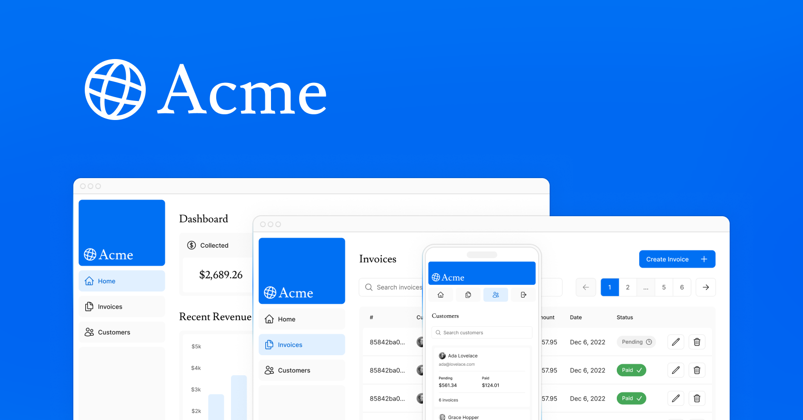

## Next.js App Router Course



Este proyecto corresponde al `App Router Course` de Next.js. El mismo consta de 15 capítulos donde se cubren los diferentes temas de una aplicación construida con Next.js.

## Credenciales

Para poder loguearte y probar la aplicación utilizá las siguientes credenciales:

**Email:**

```
user@nextmail.com
```

**Contraseña:**

```
123456
```

##

Para más información, visitá [course curriculum](https://nextjs.org/learn) en la web de Next.js.
